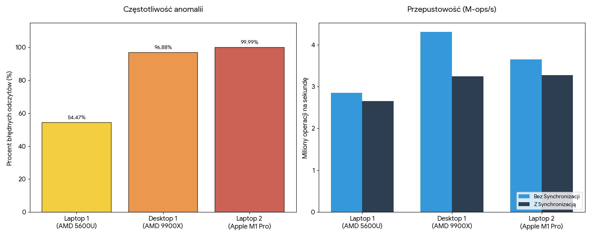

# Memory Reordering 

| Maszyna | Procesor | Częstotliwość anomalii | Przepustowość (Bez synchronizacji) | Przepustowość (Z synchronizacją) |
| :--- | :--- | :--- | :--- | :--- |
| **Laptop 1** | AMD Ryzen 5 5600U | **54,47%** | 2,85 M-ops/s | 2,65 M-ops/s |
| **Desktop 1** | AMD Ryzen 9 9900X | **96,88%** | 4,31 M-ops/s | 3,24 M-ops/s |
| **Laptop 2** | Apple M1 Pro (Apple) | **99,99%** | 3,65 M-ops/s | 3,27 M-ops/s |

