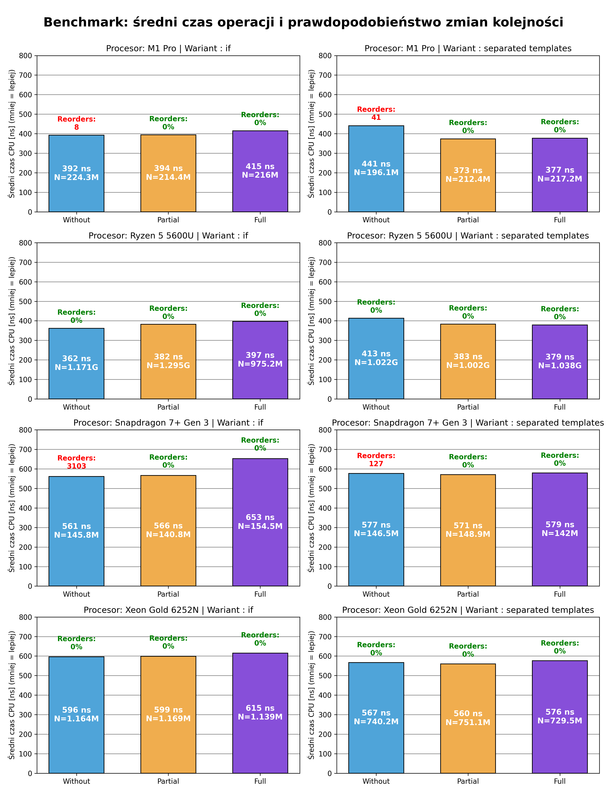

# Memory inconsistency can derail synchronization

## Testing setups

1. M1 Pro (Laptop 1)
```
================ ARCHITECTURE REPORT (macOS) ================
Model Name:     MacBook Pro
Processor:      Apple M1 Pro (Architecture: arm64)
Total Cores:    8 (Threads: 8)
Byte Order:     Little Endian
--------------------------- CACHES ---------------------------
L1 Data:        64 KiB
L1 Instruction: 128 KiB
L2 Unified:     4 MiB
L3 Cache:       Unified System Level Cache (SLC)
-------------------------- SOFTWARE --------------------------
OS Version:     macOS 15.7.2 (Build 24G325)
Kernel:         Darwin 24.6.0 Darwin Kernel Version 24.6.0: Wed Oct 15 21:12:06 PDT 2025; root:xnu-11417.140.69.703.14~1/RELEASE_ARM64_T6000 arm64
Memory (RAM):   16 GB
==============================================================
```

2. HP 13 Aero (Laptop 2)
```
HP Pavilion Aero Laptop 13-be0xxx
CPU: 
  Model: AMD Ryzen 5 5600U 
  Arch:  x86_64
  Freq:  4,3 Ghz
  Cores: 6 Cores / 12 Threads / 1 NUMA node
  Caches:
    L1d: 192 KiB (6 instances)
    L1i: 192 KiB (6 instances)
    L2:  3 MiB (6 instances)
    L3:  16 MiB (1 instance)
RAM: 16GiB DDR4 3200 MT/s SODIMM non-ECC Dual-channel
OS: Fedora Linux 43 ; Linux 6.19.9-200.fc43.x86_64
```

3. Inspur NF5280M5 (Slurm pmem-4)

```
CPU: 
  Model: Intel(R) Xeon(R) Gold 6252N CPU 
  Arch:  x86_64
  Freq:  2.30GHz
  Cores: 2 Sockets / 48 Cores / 96 Threads
  Caches:
    L1d: 1.5 MiB (48 instances)
    L1i: 1.5 MiB (48 instances)
    L2:  48 MiB (48 instances)
    L3:  71.5 MiB (2 instances)
RAM: 192GB PMem DDR4 DIMM (up to 2,666 MT/s)
OS: openSUSE Leap 15.4 ; Linux 6.0.5-1-default
Compiler: g++ 13.1.1
```

4. OnePlus Nord 4 (Android)

```
CPU: 
  Model: Qualcomm® Snapdragon™ 7 Plus Gen 3 (Qualcomm SM7675)
  Arch: arm64-v8a
  Freq: variable per core 3x1.9 GHz, 4x2.61 GHz, 1x2.8 GHz
  Cores: 8 core / 8 threads
  Caches:
    L1d: 256KB (8 instances)
    L1i: 256KB (8 instances)
    L2:  2MB
    L3:  -
RAM: 16 GB LPDDR5X
OS: OxygenOs 16.0.2.401 (Android 16); Linux 6.1.118-android14-11-o-gb04e654755e2
```

## Kompilacja
Instalacja Meson, Conan i Ninja

```bash
uv venv # python3 -m venv .venv
source .venv/bin/activate # adjust shell
uv pip install conan meson ninja
```

Instalacja zależności
```bash
cd cpp/src
conan install . --output-folder=../conanbuild --build=missing
```

Konfiguracja środowiska budowania
```bash
meson setup ../mesonbuild --native-file ../conanbuild/conan_meson_native.ini
```

Kompilacja
```bash
meson compile -C ../mesonbuild
```

Uruchomienie
```
../mesonbuild/benchmark_reordering
../mesonbuild/benchmark_reordering_separated
```


## Wyniki testów
1. M1 Pro - `benchmark_reordering_separated.cpp`
```
Load Average: 1.39, 1.76, 2.04
------------------------------------------------------------------------------------------
Benchmark                                Time             CPU   Iterations UserCounters...
------------------------------------------------------------------------------------------
BM_WithoutBarrier/real_time            446 ns          441 ns    196068699 Reorder_Count=41
BM_WithPartialBarrier/real_time        374 ns          373 ns    212374789 Reorder_Count=0
BM_WithFullBarrier/real_time           378 ns          377 ns    217174315 Reorder_Count=0
```

2. M1 Pro - `benchmark_reordering.cpp`
```
Load Average: 1.73, 2.83, 2.68
------------------------------------------------------------------------------------------
Benchmark                                Time             CPU   Iterations UserCounters...
------------------------------------------------------------------------------------------
BM_WithoutBarrier/real_time            394 ns          392 ns    224253793 Reorder_Count=8
BM_WithPartialBarrier/real_time        395 ns          394 ns    214398493 Reorder_Count=0
BM_WithBarrier/real_time               416 ns          415 ns    215988921 Reorder_Count=0
```

3. M1 Pro - `benchmark_reordering_separated.cpp` (`--benchmark_min_time=180s`)
```
------------------------------------------------------------------------------------------
Benchmark                                Time             CPU   Iterations UserCounters...
------------------------------------------------------------------------------------------
BM_WithoutBarrier/real_time            356 ns          355 ns    714142217 Reorder_Count=1
BM_WithPartialBarrier/real_time        436 ns          432 ns    603749475 Reorder_Count=0
BM_WithFullBarrier/real_time           401 ns          398 ns    582111940 Reorder_Count=0
```

4. Ryzen 5 5600U - `benchmark_reordering --benchmark_min_time=300s`

```
------------------------------------------------------------------------------------------
Benchmark                                Time             CPU   Iterations UserCounters...
------------------------------------------------------------------------------------------
BM_WithoutBarrier/real_time            363 ns          362 ns   1170530947 Reorder_Count=0
BM_WithPartialBarrier/real_time        384 ns          382 ns   1294999346 Reorder_Count=0
BM_WithBarrier/real_time               399 ns          397 ns    975169792 Reorder_Count=0
```

5. Ryzen 5 5600U - `benchmark_reordering_separated --benchmark_min_time=300s`

```
------------------------------------------------------------------------------------------
Benchmark                                Time             CPU   Iterations UserCounters...
------------------------------------------------------------------------------------------
BM_WithoutBarrier/real_time            415 ns          413 ns   1022387314 Reorder_Count=0
BM_WithPartialBarrier/real_time        385 ns          383 ns   1001579295 Reorder_Count=0
BM_WithFullBarrier/real_time           380 ns          379 ns   1037848971 Reorder_Count=0
```

6. Intel(R) Xeon(R) Gold 6252N (Slurm PMEM) - `benchmark_reordering`

```
------------------------------------------------------------------------------------------
Benchmark                                Time             CPU   Iterations UserCounters...
------------------------------------------------------------------------------------------
BM_WithoutBarrier/real_time            596 ns          596 ns      1164002 Reorder_Count=0
BM_WithPartialBarrier/real_time        599 ns          599 ns      1169048 Reorder_Count=0
BM_WithBarrier/real_time               615 ns          615 ns      1139063 Reorder_Count=0
```

7. Intel(R) Xeon(R) Gold 6252N (Slurm PMEM) - `benchmark_reordering_separated`

```
------------------------------------------------------------------------------------------
Benchmark                                Time             CPU   Iterations UserCounters...
------------------------------------------------------------------------------------------
BM_WithoutBarrier/real_time            624 ns          624 ns      1111804 Reorder_Count=0
BM_WithPartialBarrier/real_time        631 ns          631 ns      1098909 Reorder_Count=0
BM_WithFullBarrier/real_time           635 ns          635 ns      1095355 Reorder_Count=0
```

7. Intel(R) Xeon(R) Gold 6252N (Slurm PMEM) - `benchmark_reordering_separated --benchmark_min_time=60s`
```
------------------------------------------------------------------------------------------
Benchmark                                Time             CPU   Iterations UserCounters...
------------------------------------------------------------------------------------------
BM_WithoutBarrier/real_time            567 ns          567 ns    740247032 Reorder_Count=0
BM_WithPartialBarrier/real_time        560 ns          560 ns    751059588 Reorder_Count=0
BM_WithBarrier/real_time               576 ns          576 ns    729456369 Reorder_Count=0
```

8. Snapdragon 7 Plus Gen 3 (Android) - `benchmark_reordering --benchmark_min_time=60s`

```
------------------------------------------------------------------------------------------
Benchmark                                Time             CPU   Iterations UserCounters...
------------------------------------------------------------------------------------------
BM_WithoutBarrier/real_time            606 ns          601 ns    131940818 Reorder_Count=14.442k
BM_WithPartialBarrier/real_time        581 ns          578 ns    144517433 Reorder_Count=0
BM_WithBarrier/real_time               610 ns          607 ns    100000000 Reorder_Count=0
```

```
benchmark_reordering --benchmark_min_time=60s
------------------------------------------------------------------------------------------
Benchmark                                Time             CPU   Iterations UserCounters...
------------------------------------------------------------------------------------------
BM_WithoutBarrier/real_time            566 ns          561 ns    145758479 Reorder_Count=3.103k
BM_WithPartialBarrier/real_time        571 ns          566 ns    140806610 Reorder_Count=0
BM_WithBarrier/real_time               662 ns          653 ns    154525611 Reorder_Count=0
```


9. Snapdragon 7 Plus Gen 3 (Android) - `benchmark_reordering_separated --benchmark_min_time=60s`

```
------------------------------------------------------------------------------------------
Benchmark                                Time             CPU   Iterations UserCounters...
------------------------------------------------------------------------------------------
BM_WithoutBarrier/real_time            579 ns          577 ns    146461408 Reorder_Count=127
BM_WithPartialBarrier/real_time        573 ns          571 ns    148949402 Reorder_Count=0
BM_WithFullBarrier/real_time           583 ns          579 ns    141983254 Reorder_Count=0
```


## Rezultaty
| Maszyna       | Procesor | Liczba iteracji | Liczba anomalii | Przepustowość (Bez synchronizacji) | Przepustowość (Częściowa bariera) | Przepustowość (Pełna bariera) |
|:--------------| :--- |:----------------|:----------------| :--- | :--- |:----------------------------------|
| **Laptop 1**  | Apple M1 Pro | **~224M** | 8               | 2,54 M-ops/s| 2,53 M-ops/s | 2,40 M-ops/s |

## Notki

Store Coalescing - 
**TLDR** - zapisy w tej samej linii Cache są łączone i wysyłane po wykonaniu (mała szansa anomalii), 
ale będąc w różnych liniach Cache, operacje są rozdzielone (większa szansa anomalii).

procesor może łączyć kilka operacji zapisu dotyczących pojedynczej linii Cache w jedną, co może 
powodować, że wymuszenie znajdowania się zmiennych w innych liniach "poprawia" częstotliwość występowania anomalii, 
ponieważ zmienne nie są łączone w jedną linię Cache, co może prowadzić do większej liczby przypadków, 
gdzie operacje zapisu są widoczne dla innych wątków w różnym czasie.

> ***WARNING*** CPU scaling is enabled, the benchmark real time measurements may be noisy and will incur extra overhead.

## Wykresy
