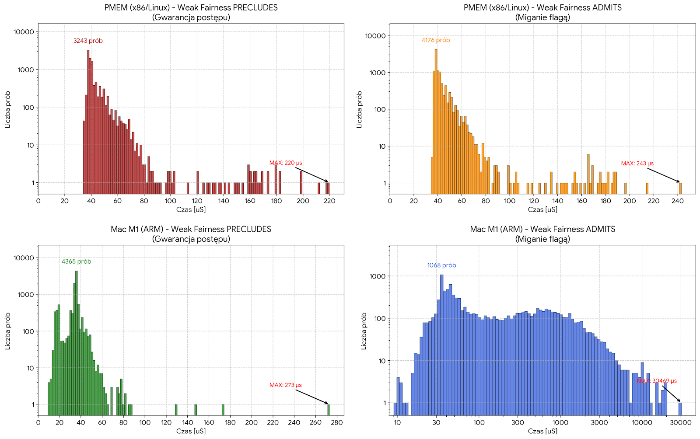
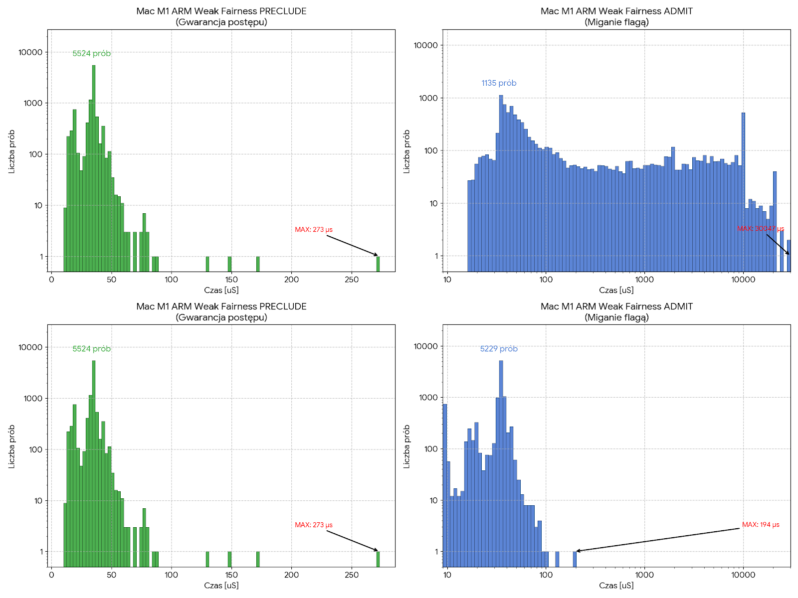

### Weak fairness preclude


### Weak fairness admit


### Preclude C++
```C++
void thread_1() {
  // await f.load(||)
  while (!f.load(std::memory_order_relaxed)) {
  }
  // fence(R||RW)
  std::atomic_thread_fence(std::memory_order_acquire);
}
```

```C++
void thread_2() {
// await ¬f.load(||)
  while (f.load(std::memory_order_relaxed)) {
  }
  std::atomic_thread_fence(std::memory_order_acquire);
  
  // f.store(true)
  f.store(true);
}
```

### Admit C++
```C++
void thread_1() {
  // while ¬f.load(||W)
  while (!f.load(std::memory_order_acquire)) {

    // g.store(true, ||W)
    g.store(true, std::memory_order_release);

    // g.store(false, ||R)
    g.store(false, std::memory_order_seq_cst);
  }
}
```

```C++
void thread_2() {
  // await g.load(||)
  while (!g.load(std::memory_order_relaxed)) {
  }

  // fence(R∥RW)
  std::atomic_thread_fence(std::memory_order_acquire);

  // f.store(true, ||)
  f.store(true, std::memory_order_relaxed);
}
```


### Results x86/ARM



### Interval of `g=true`
```C++
void thread_1() {
  // while ¬f.load(||W)
  while (!f.load(std::memory_order_acquire)) {

    // g.store(true, ||W)
    g.store(true, std::memory_order_release);

>>> for(volatile int i=0; i<15; i++);

    // g.store(false, ||R)
    g.store(false, std::memory_order_seq_cst);
  }
}
```

### Results ARM
